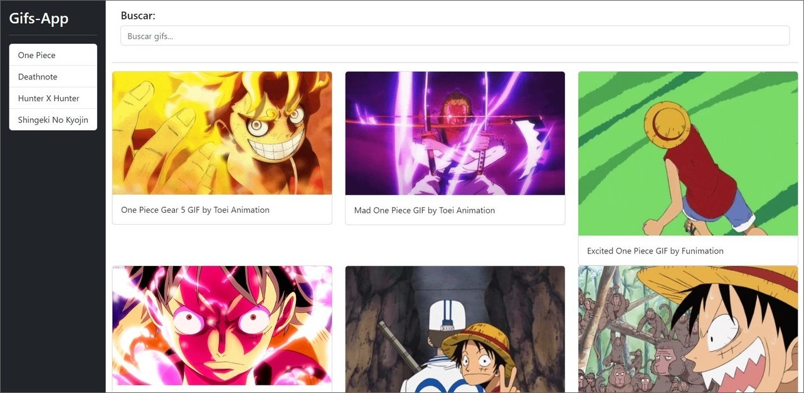

# Buscador de Gifs con Angular
Esta página web fue creada con Angular y permite buscar gifs por nombre utilizando la API de https://developers.giphy.com/. Además, utiliza LocalStorage para guardar las búsquedas y Bootstrap para los estilos.

## Tecnologías principales
-  Angular  
-  LocalStorage  
-  Bootstrap  
-  API de https://developers.giphy.com/  

## Capturas de pantalla
Aquí se pueden ver algunas capturas de pantalla de la página en modo desktop.

## Créditos
Este proyecto fue creado como parte del curso "Angular: De cero a experto" dictado por Fernando Herrera en Udemy. El link del curso es https://www.udemy.com/course/angular-fernando-herrera/.
## Link
Puedes acceder a la página web aquí: [URL del sitio](https://gifs-angular-yha.netlify.app/).
